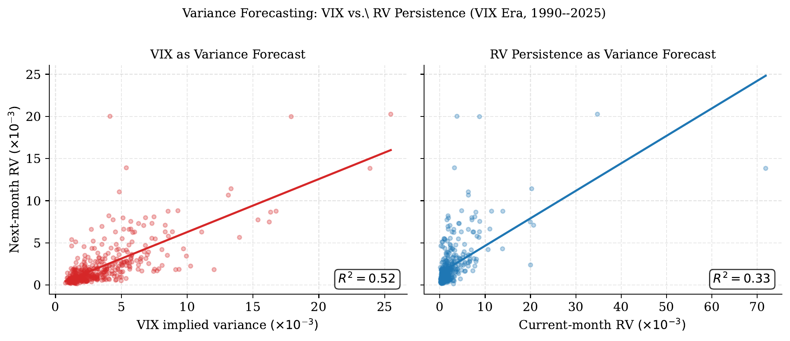
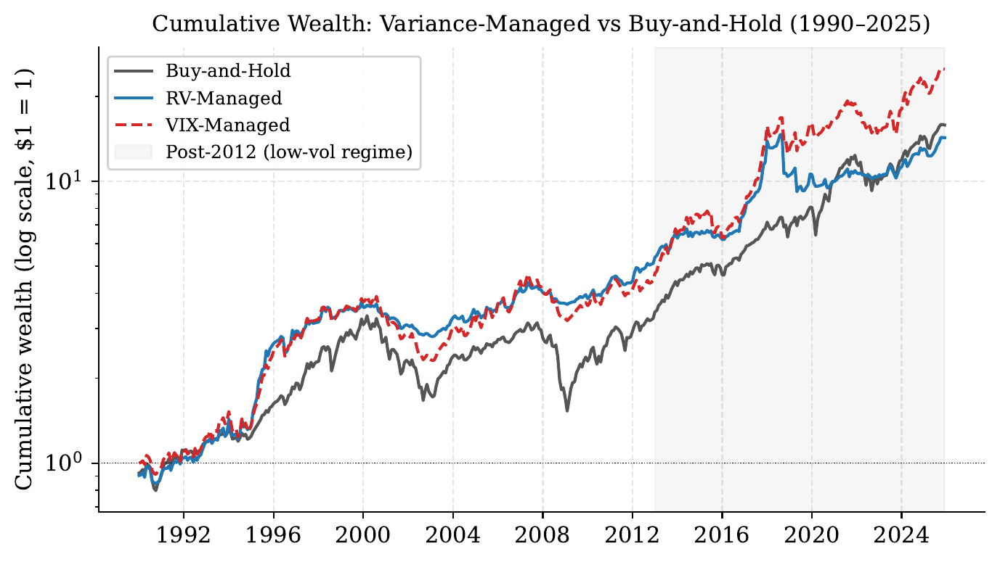
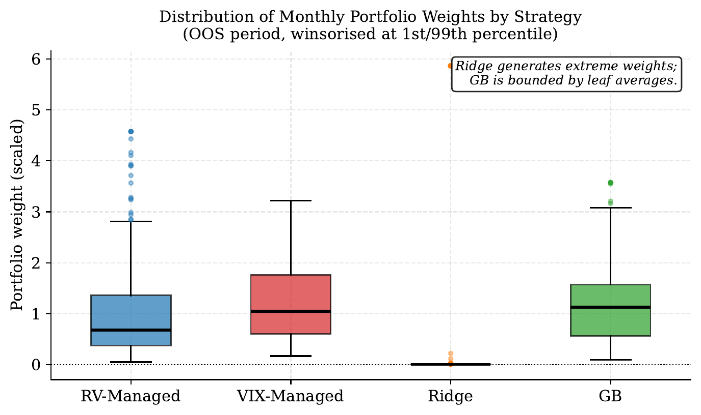
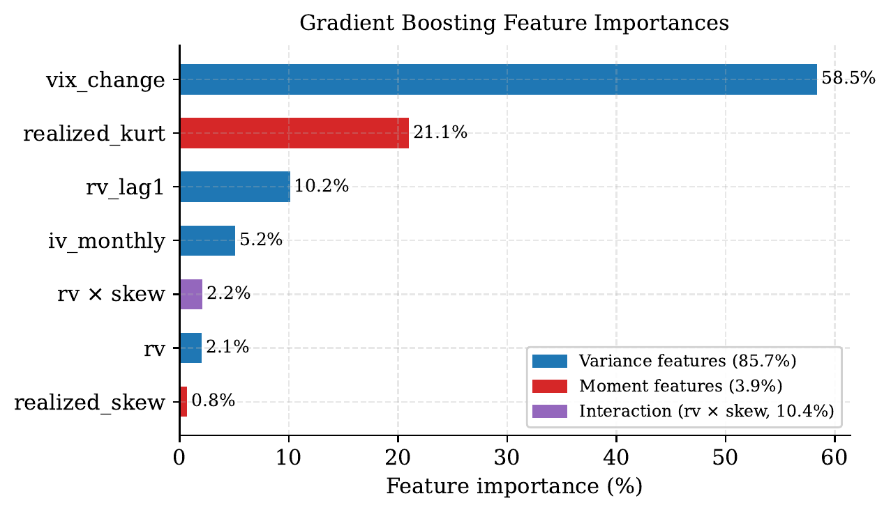
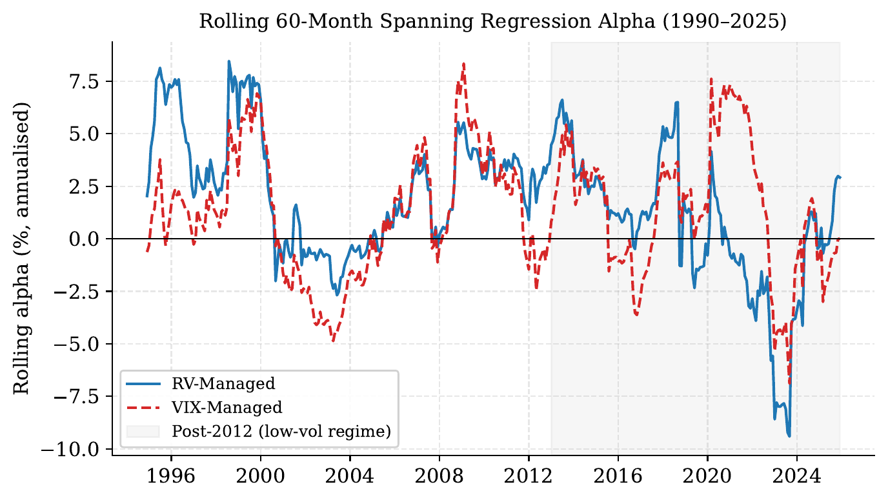
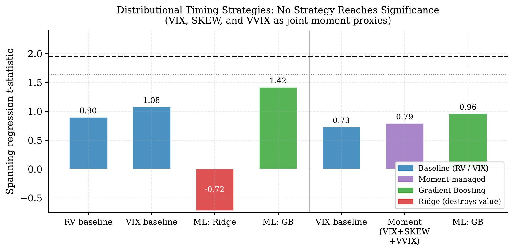

This post is not related to mechinterp. I am just finishing up a quantitative finance working paper, written under the advising of Prof. David Shimko at NYU, and the full draft is [here as a PDF](implied_moment_indices_vmp.pdf). The premise of this paper is that options markets price the entire future return distribution, and CBOE publishes free daily indices summarizing it. Can that forward looking information improve the simplest market timing strategy that works, or does a backward looking variance estimate already capture everything useful? This post walks through the paper, the code behind the main results, and a few takeaways that generalize beyond finance.

The TLDR is mostly no, but the nuances are deeply informative.

## The framework

The baseline is [Moreira and Muir (2017)](https://doi.org/10.1111/jofi.12513), one of the cleanest results in empirical asset pricing. Each month, hold the market with weight inversely proportional to last month's realized variance:

$$f^{\sigma}_{t+1} = \frac{c}{\hat{\sigma}^2_t} \, f_{t+1}$$

where $f_{t+1}$ is the market excess return and $c$ is a constant that scales the strategy to the same volatility as buy and hold, i.e. lever up when markets are calm, cut exposure when they are turbulent. The reason this works is an asymmetry in predictability: variance is strongly autocorrelated month to month, but expected returns barely move with it. So after a volatility spike you keep roughly the same expected return while carrying much more risk. The risk to return tradeoff is time varying, and variance is the predictable half of it.

Performance is evaluated with a spanning regression of the managed return on the buy and hold return:

$$f^{\sigma}_{t+1} = \alpha + \beta f_{t+1} + \varepsilon_{t+1}$$

A positive significant $\alpha$ means the managed strategy expands the mean-variance frontier: you could not have gotten its returns by just holding more or less of the market. Alongside alpha, I report the information ratio (alpha per unit of residual risk), which matters later when alpha and Sharpe start disagreeing.

The portfolio construction is short enough to show in full. The `shift(1)` means the weight applied to month $t+1$ uses only variance measured in month $t$.

```python
def vol_managed_portfolio(monthly_returns, variance_series, leverage_cap=None):
    """Moreira & Muir Eq. 1: w_t = c / var_t, applied to next month's return."""
    var_lagged = variance_series.shift(1)
    raw_w = 1.0 / var_lagged

    valid = np.isfinite(raw_w) & np.isfinite(monthly_returns) & (var_lagged > 0)
    raw_w, ret = raw_w[valid], monthly_returns[valid]

    # c normalizes to buy-and-hold volatility. It scales alpha and SE(alpha)
    # equally, so it cancels out of the t-statistic.
    c = ret.std() / (raw_w * ret).std()
    w = raw_w * c

    if leverage_cap is not None:
        w = w.clip(upper=leverage_cap)
        w = w * (ret.std() / (w * ret).std())  # renormalize after capping

    return pd.DataFrame({'managed_ret': w * ret, 'bh_ret': ret, 'weight': w})
```

Note from literature: [Cederburg, O'Doherty, Wang, and Yan (2020)](https://doi.org/10.1016/j.jfineco.2020.04.015) evaluate volatility management across 103 strategies and find that in-sample spanning alphas frequently fail to survive as real time, out-of-sample gains, because the coefficients mapping signals to weights drift across regimes. Everything in the paper that involves fitting anything is therefore done on expanding windows, using only data available at portfolio formation.

## Data

Market returns come from the Kenneth French Data Library: July 1926 through December 2025, which is 1,194 months and about 26,000 daily observations. Daily returns build the within-month realized moments. Realized variance for month $t$ is the sum of squared daily deviations, $\text{RV}_t = \sum_{d \in t}(r_d - \bar{r}_t)^2$, and I compute realized skewness and excess kurtosis from the same daily returns.

The implied side comes from four CBOE indices, each a scalar summary of one feature of the option-implied distribution:

- **VIX** (1990 to present): 30 day model free implied volatility, converted to monthly implied variance as $(\text{VIX}/100)^2/12$.
- **CBOE SKEW** (2010 to present): the cost of out-of-the-money puts relative to a symmetric distribution. It's at 100 when the implied distribution is symmetric and rises as the left tail gets more expensive. Its sample average is 131, so the index prices a persistent crash premium.
- **VVIX** (2007 to present): the volatility of VIX itself, used for uncertainty about volatility, which loads on the tails.
- **VIX3M** (2006 to present): three month implied volatility, the slope VIX3M minus VIX measures the term structure, which inverts when near term fear spikes.

One column of summary statistics does a lot of foreshadowing, the AR(1) coefficients. Monthly realized variance has an autocorrelation of 0.53 and VIX of 0.81. Realized skewness comes in at 0.11 and realized kurtosis at 0.02. Variance is persistent and therefore timeable. The higher realized moments are nearly white noise at the monthly frequency, which is a problem for any strategy that wants to condition on them.

## Replicating the baseline

On the full 100 year sample, the RV-managed portfolio earns an annualized alpha of 4.56% with $t = 3.10$ and beta of 0.60. Moreira and Muir report 4.86% with $t = 3.11$ on a slightly shorter sample, so the replication is essentially exact. The Sharpe ratio rises from 0.450 (buy and hold) to 0.518. Adding the post publication decade of data neither sharpens nor weakens the original result, which is itself worth knowing given how many published anomalies decay out of sample.

## Does VIX beat realized variance?

VIX should win, since it is a forward looking, model free variance estimate extracted from option prices, while trailing realized variance just assumes next month looks like last month. [Bollerslev, Tauchen, and Zhou (2009)](https://doi.org/10.1093/rfs/hhp008) showed the gap between implied and realized variance predicts aggregate returns, so VIX contains real information beyond RV.

As a forecaster, VIX wins decisively. Over 1990 to 2025, VIX implied variance predicts next month realized variance with an out-of-sample $R^2$ of 0.32. RV persistence (use this month's variance as the forecast) scores negative 0.07, worse than just predicting the unconditional mean, because persistence forecasts overshoot badly around regime breaks like 2008 and COVID.



As a portfolio signal, VIX loses:

| Strategy | Alpha (%) | t-stat | Beta | Sharpe | IR |
|---|---|---|---|---|---|
| RV-managed | 4.16 | 1.99 | 0.629 | 0.653 | 0.354 |
| VIX-managed | 2.91 | 1.80 | 0.795 | 0.670 | 0.317 |

The Sharpe column flips the ranking, and the resolution of that disagreement is the most instructive mechanism in the paper. Both portfolios are normalized to the same volatility by the constant $c$, so the Sharpe gap cannot come from risk differences. It comes from beta. VIX moves smoothly (AR(1) of 0.81), so VIX managed weights stay near full market exposure and the portfolio inherits more of the equity premium: beta 0.795 against RV's 0.629. RV managed weights react harder to volatility shocks, pulling the portfolio further from the market and generating more independent timing value (higher alpha) but less passive premium capture. The information ratio strips the beta channel out, and it agrees with alpha that RV is the better timing signal. A better forecast and a better portfolio are different objectives. [Bozovic (2024)](https://doi.org/10.1016/j.irfa.2024.103353) reaches a consistent conclusion and argues VIX's smoother weights mainly help through lower trading costs, not better gross timing.



## Adding skewness and kurtosis by hand

If variance timing works, distribution timing should work better. [Harvey and Siddique (2000)](https://doi.org/10.1111/0022-1082.00247) showed skewness is priced in the cross section of returns, and Conrad, Dittmar, and Ghysels (2013) found the same for option-implied moments. A risk averse investor should plausibly cut exposure when the distribution is unusually left skewed or fat tailed.

The implementation multiplies the variance weight by z-score tilt factors, computed on expanding windows so nothing uses future information:

```python
# Expanding-window z-score, lagged one month
skew_z = ((skew - skew.expanding(24).mean()) / skew.expanding(24).std()).shift(1)
kurt_z = ((kurt - kurt.expanding(24).mean()) / kurt.expanding(24).std()).shift(1)

skew_adj = (1 + 0.2 * skew_z).clip(0.5, 1.5)   # more negative skew -> less exposure
kurt_adj = (1 - 0.2 * kurt_z).clip(0.5, 1.5)   # fatter tails -> less exposure

w = (c / var_lagged) * skew_adj * kurt_adj
```

The 0.2 coefficient means a one SD moment shock moves the position by 20%, and the clip keeps any single signal from more than doubling or halving the variance-implied weight. The moments are deliberately secondary to the variance signal.

Every version of this hurts. Eight variants (realized skew, realized kurtosis, both, CBOE SKEW, combinations, across two sample periods) and all eight reduce alpha, Sharpe, and information ratio relative to variance only. On the full sample, alpha drops from 4.56% to between 4.25% and 4.34% depending on the variant; in the VIX era, from 2.91% to as low as 2.36%; with CBOE SKEW in the short post 2011 sample, to 1.53% and below.

The explanation is in those AR(1) coefficients from the data section. Realized skewness at 0.11 and kurtosis at 0.02 mean last month's distributional shape carries almost no information about next month's, so the tilts add noise to a working signal. No reasonable rescaling of a nonpersistent signal extracts a timing rule from it. This matches [Kostakis, Panigirtzoglou, and Skiadopoulos (2011)](https://doi.org/10.1287/mnsc.1110.1346), who use the entire option-implied density for portfolio choice and conclude the forward looking mean, not the higher moments, drives their gains.

## Letting ML find the mapping

Handcrafted linear tilts are a restrictive functional form, so the next step is to hand the signals to models that can find nonlinear structure. Four models (Ridge, Lasso, random forest, gradient boosting) are trained to forecast next-month realized variance from seven features: current RV, VIX implied variance, realized skew, realized kurtosis, lagged RV, the monthly VIX change, and an RV times skew interaction. The forecast then replaces $\hat{\sigma}^2_t$ in the portfolio formula.

The loop is strict expanding window. The scaler is refit inside every iteration, on training data only, so the standardization never sees the future:

```python
for t in range(MIN_TRAIN, len(df_ml)):
    X_train = df_ml.loc[:t-1, feature_cols].values
    y_train = df_ml.loc[:t-1, 'target_rv'].values   # target_rv = rv.shift(-1)
    X_test  = df_ml.loc[[t], feature_cols].values

    scaler = StandardScaler()
    X_train_s = scaler.fit_transform(X_train)
    X_test_s  = scaler.transform(X_test)

    for name, template in models.items():
        model = clone(template)
        model.fit(X_train_s, y_train)
        pred = model.predict(X_test_s)[0]
        ml_predictions[name][t] = max(pred, 1e-6)  # variance can't be negative
```

For pure forecasting, the models land between the two benchmarks: out of sample $R^2$ of 0.14 to 0.21, all below VIX's 0.32. For portfolios, the results split sharply by model class:

| Strategy | Alpha (%) | t-stat | Sharpe | IR |
|---|---|---|---|---|
| RV baseline (same OOS months) | 4.20 | 1.75 | 0.641 | 0.341 |
| VIX baseline (same OOS months) | 3.36 | 1.84 | 0.692 | 0.351 |
| Ridge | -1.91 | -0.59 | -0.004 | -0.125 |
| Lasso | -0.87 | -0.29 | 0.039 | -0.056 |
| Random forest | 3.07 | 1.71 | 0.675 | 0.322 |
| Gradient boosting | 3.72 | 1.90 | 0.687 | 0.357 |

The linear models do not merely underperform, they destroy value. Portfolio weight is proportional to $1/\hat{\sigma}^2$, so forecast errors near zero get amplified enormously. Linear models extrapolate beyond their training range and occasionally emit near zero variance forecasts in calm regimes. The floor and the inversion turn those into giant positions. Tree models physically cannot do this. Their predictions are averages over training leaves and never fall below the minimum variance they have seen. The same feature set is safe in one model class and dangerous in another purely because of how the output gets consumed downstream.



This is also why models with worse forecasting $R^2$ than VIX still produce better portfolios than VIX. Mean squared error weights all errors equally, while inverse variance weighting concentrates everything on the low variance tail. [Gu, Kelly, and Xiu (2020)](https://doi.org/10.1093/rfs/hhaa009) document the same tree over linear pattern across asset pricing prediction tasks broadly.

## The ablation

Gradient boosting with all seven features is the best ML strategy, and the flattering interpretation is that ML extracts the higher moment signal the handcrafted tilts could not. The ablation test is to rerun gradient boosting with only the four variance features (RV, implied variance, lagged RV, VIX change).

Variance only gradient boosting reaches alpha 3.33% with IR 0.332. The full feature set gets 3.72% and 0.357. So the increment from skewness and kurtosis is 0.39 percentage points of alpha and 0.025 of information ratio, and the feature importances imply that variance related features carry 85.7% of total importance, the higher moments 2.2% and 1.7% directly.



The conclusion is that gradient boosting wins through nonlinear variance modeling, and distributional information adds a modest increment on top. This one check changed the paper's central claim, which is why I now consider ablations mandatory rather than optional.

## Robustness, or where the result lives and dies

Splitting the VIX era into subsamples shows the alpha is concentrated in time. From 1990 to 2012, RV managed earns alphas of 6.4% to 7.0% per subsample. From 2013 onward, it earns 0.65% with a t-stat of 0.17 and a Sharpe below buy and hold. The post 2012 regime (low volatility, QE, a buy and hold Sharpe of 0.88) gives a variance timer almost nothing to time. VIX managed holds up slightly better in that regime but is never significant in it. The full sample numbers are real, and they are also conditional on a volatility regime that has not existed for over a decade.



Leverage constraints cut the other way. The unconstrained RV strategy's 99th-percentile weight is 5.16, a five times levered market position in its calmest months, which no actual risk desk would carry. Capping weights at 1.5 (the Reg-T limit) raises the Sharpe from 0.653 to 0.701 and the IR from 0.354 to 0.374, the best of any strategy in the paper, ML included. The extreme leverage months were noise. Expected returns do not quintuple when variance gets very low, so truncating those positions costs little alpha (4.16% to 3.67%) and removes a lot of residual variance. The t-stat actually rises. The most attractive strategy in the paper is also the most boring one, inverse realized variance, capped at 150%.

Finally, the original motivating idea, timing with VIX, SKEW, and VVIX jointly as a stand in for the full implied distribution. On the samples where all three exist (2007 onward, 228 months; with SKEW, 2011 onward), nothing is significant. Gradient boosting tops out at $t = 1.42$. But the baselines fail too. Plain RV and VIX management, highly significant over long samples, earn t-stats below 1.1 on the same window. The test does not say distributional timing fails. It says an 18 year sample dominated by a bull market cannot distinguish any of these strategies from noise, including the ones known to work.



The paper closes this gap partially with a proof of concept, calibrating a full risk neutral density model (ARM, [zur Linden 2023](https://doi.org/10.3905/jod.2023.1.178)) to six months of SPX option chains, where the ARM implied variance modestly outforecasts VIX at the daily frequency ($R^2$ 0.073 vs 0.059). A real test needs historical option chains going back decades, which is the data access problem flagged as future work.

## My takeaways

**1. A better forecast is not a better decision.** VIX beats RV decisively on forecasting $R^2$ and loses on portfolio alpha. The forecast metric and the decision objective weight errors differently, and the gap between them is where the surprises live. The same trap exists anywhere a proxy metric stands between you and the thing you care about. A probe with great decoding accuracy can still be the wrong handle for steering, because the intervention weights errors differently than the eval did.

**2. Failures live in compositions, not components.** Ridge is a reasonable variance forecaster and a catastrophic portfolio signal, for reasons visible only when you look at the forecaster and the inverse variance rule together. Evaluating components in isolation would never find this. Whatever system consumes your model's output is part of the experiment.

**3. Ablate your own headline result before someone else does.** The "ML finds higher moment structure" story survived every test except the one where the higher moment features were removed. That check took an afternoon and rewrote the paper's central claim. Whatever component your story depends on, remove exactly that component and see how much of the effect survives.

**4. Audit for leakage like an adversary, and say so.** Backtests are leakage machines, so the pipeline got the hostile-referee treatment. Scaler fit inside the training window only, signal timing strictly lagged, the one full sample constant shown to cancel out of the test statistic, inference rerun with Newey-West errors (t-stats drop 5 to 10%, all conclusions survive). The audit found nothing, which is the point. "Nothing after specifically hunting for the standard failure modes" is a much stronger claim than "nothing that I noticed."

**5. Sometimes the honest answer is that the sample cannot answer the question.** The most novel test in the paper returns uniform insignificance, and so do the baselines next to it. The right conclusion was about statistical power, not about the hypothesis, and writing "this window cannot answer the question" instead of a hedged positive result was the hardest sentence in the paper.

The full draft, with all the tables and the robustness appendix, is [here](implied_moment_indices_vmp.pdf). The paper is still getting updates, so if you find something broken in it, please reach out!
